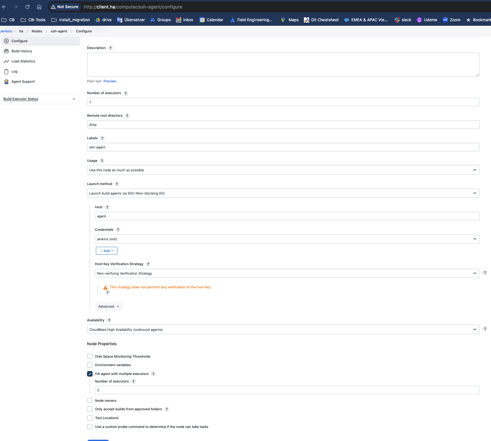

# CloudBees Ci traditional-ha/hs demo 

Docker compose setup for a traditional Cloudbees CI installation in HA (active/active) mode

# Links

* https://docs.cloudbees.com/docs/cloudbees-ci/latest/ha/specific-ha-installation-traditional
* https://docs.cloudbees.com/docs/cloudbees-ci/latest/ha/ha-considerations
* https://docs.docker.com/compose/networking/
* https://www.haproxy.com/blog/haproxy-configuration-basics-load-balance-your-servers
* https://www.haproxy.com/documentation/haproxy-configuration-manual/latest/
* https://www.claudiokuenzler.com/blog/900/how-to-use-docker-host-ip-address-inside-application-container
* https://eventuate.io/docs/usingdocker.html
* https://docs.linuxserver.io/images/docker-webtop/#lossless-mode

# Architecture

The docker-compose setup follows this design with the following limitations:

* SSL 443 is not enabled yet. All traffic for local demo is going through port 80/8080
* NFS server is not part of the demo. We will use a local directory on the host system 

* 

# Pre-requirements

* This demo has been tested on MacOs 14.7
* Docker-Desktop 4.24.0 (122432)
* Engine: 24.0.6
* Compose: v2.22.0-desktop.2
* Docker-compose v3
* Web browser, Firefox has been tested, Chrome should work also 

# Setup

The setup consists of the following containers:

- Operations center
- Controller 1
- Controller 2
- SSH-Agent 1
- HAProxy Load Balancer
- Optional, but not required: Linux box with Firefox accessible via VNC from an external browser
  - You will be able to access the demo environment either from your browser or optional from a browser container box


The setup is self sufficient and does not require any modifications on the Docker host or anywhere else outside of the docker compose environment, except for the persistence - local paths on the docker host are used as persistence volumes. NFS volumes are not used at the moment.
Controller 1 and Controller 2 share the same $JENKINS_HOME dir.


The Operations Center and both controllers are behind HAProxy.

- If a request comes to HAProxy with $OC_URL host header, it is forwarded to the operations center container
- If a request comes with $CLIENTS_URL host header, it is load balanced between all client controllers
- The load balancing for client controllers has sticky sessions enabled

## env.sh

- `OC_URL` is the URL you want the operations center to respond on.
- `CLIENTS_URL` is for the controllers. There is only one URL for both controllers.
- `DOCKER_IMAGE_OC` and `DOCKER_IMAGE_CLIENT` are the CB CI versions on operations center and controllers
- `IP_PREFIX` is a prefix for the internal docker compose network
- `PERSISTENCE_PREFIX` is the path for the persistence volumes on the docker host
- `JENKINS_AGENT_SSH_PUBKEY`=$(cat ~/.ssh/id_rsa.pub)  assumes your ssh pub key is under this path. adjust it for your needs

## docker-compose.yaml.template

This template is used to render the `docker-compose.yaml` file using the environment variables in `env.sh`. Please do not modify docker-compose.yaml directly, since it will be overwritten by `up.sh`. Modify this template instead.

## up.sh

A helper script to:

- Create the persistence volumes
- Render the docker-compose.yaml from the template.
- Run `docker compose up`

## Stop

Run `down.sh`. This will issue docker compose down to stop the running containers.

## Clean up

- Stop the running containers using `down.sh`. Then,
- Run `delete_volumes.sh`. This will delete the persistence directories on the host (docker volumes)


## Deploy

- Examine `env.sh` and modify if needed.
- Examine `docker-compose.yaml.template` and modify if needed.
- Run `up.sh`.


# Browser Access

Just Firefox has been tested to access the Lab (Maybe chrome or others are also possible)
There are two options on how to access the CloudBess CI demo lab:

## Option1: Join the Desktop VM in your Browser

If you don't have Firefox installed or other issues using your host browser:

* open a browser and point it to [http://localhost:3000](http://localhost:3000). 
* This will open a VNC session to the Linux container with a Firefox browser in it.
* From the start menu (Top to the left) open Firefox browser.


## Option2: Use your Firefox on your PC

Chrome should work as well

Add the following to your `/etc/hosts` file 

```
127.0.0.1	localhost oc.ha client.ha
```
Flush the DNS cache (MacOs)

> sudo dscacheutil -flushcache; sudo killall -HUP mDNSResponder

* open Firefox on your PC

## Disable HTTPS Only mode and add the CloudBees host names

If you hit SSL cert issues in your browser, do the following:  (Haven't checked yet how to do this in Chrome)

* As the demo HAProxy doesn't support HTTPS/SSL yet, we use Firefox with disabled `HTTPS only mode`.
* Adjust the following exceptions:

Under Firefox settings search "HTTPS Only"

Disable HTTPS only:


Add exceptions:


# Open the Operations Center 

* Point the Firefox browser to http://$OC_URL  (by default this is http://oc.ha/)
* Unlock the Operations center, you will find the key in the docker-compose logs on your console
  
```
operations-center         | Jenkins initial setup is required. An admin user has been created and a password generated.
operations-center         | Please use the following password to proceed to installation:
operations-center         |
operations-center         | XXXXXXXXXXXXXXXXXXXXXXXXXXX 
```
* Request a licence and add admin user details
* Install the suggested Plugins
* Under Operations Center -> manage Jenkins -> Security 
  * Disable TCP Port 50000 (we don't need it, all traffic in this demo is HTTP or SSH)
  * 
  * Enforce Security realm and SSO
  * 

# Create a client controller item

* In the Operations Center, create a client controller item.
* Ensure you have "websocket" enabled in the connection configuration
* 
* 
* 
* Push the configuration to http://$CLIENTS_URL  (by default this is http://client.ha/ )
  * Not required: Try to access http://$CLIENTS_URL/ in Firefox
  * Not required: Request a licence and add admin user details
* Install HA plugin (active/active) on http://$CLIENTS_URL/
* 
* Restart the Controller
* 
* The two replicas must be restarted
  ```
  docker-compose restart ha-client-controller-1
  docker-compose restart ha-client-controller-2
  ```
* Controller 2 will begin starting when controller 1 is ready
* It takes some minutes now, you can see the HA status in the controllers` Manage Jenkins section
* 


# On the controller: Create a jenkins ssh credential

Join the Controller and add an SSH Credentials (private key)


## Optional, if you don't have an ssh key: Create a key pair with: `ssh-keygen -t rsa -f agent-key`

Adjust the path to the ssh key in the `env.sh` file
> export JENKINS_AGENT_SSH_PUBKEY=$(cat ~/.ssh/id_rsa.pub)

Use the private part in the Controller when defining credentials to connect to the agent.
Choose credentials with username and private key. Username is jenkins.

# Create a SSH Agent Node



# Create a test Pipeline

Once the SSH Agent has been created you can create a simple Test Pipeline on the HA Controller

[test/Jenkinsfile-ssh-agent.groovy](test/Jenkinsfile-ssh-agent.groovy)

Once the Pipeline is started you can  demo one replica to demo the build will take over to the other replica and continues to run if the controller replica is shut down

* Start the Pipeline
* Check what replica you are running on
* Enable HA developer mode to show the info icon to the bottom of the Controller
* This show you also the IP address of your session replica 
* shut your controller replica down (see in `docker.compose.yaml` for the ip address mapped to the docker container name)
```
docker-compose restart ha-client-controller-1 # or ha-client-controller-2 depending on where yu are 
```
* reload the controller job page in Firefox, you should be now on the other replica and job should resume to work

# Extra Notes used during development of the demo (Not required during the setup)

## DNS Flush (MacOs)
> sudo dscacheutil -flushcache; sudo killall -HUP mDNSResponder

## Useful Docker commands

### Inspect network

```
docker network ls
docker network inspect traditional-ha_demo-network
```

### Restart container

```
docker-compose restart <container>
```

Example:

```
docker-compose restart ha-client-controller-1
docker-compose restart ha-client-controller-2
```

## Details SSH Agents

### Create your ssh keys

> ssh-keygen -t rsa -b 2048 -C "your_email@example.com"

### Add your public key the agent container

add the ssh-pub key in your `docker-compose.yaml` file

```
    environment:
      - JENKINS_AGENT_SSH_PUBKEY="YOUR_PUB_KEY"

```

Restart the agent container if required

> docker-compose restart agent

Verify if the key has been applied: (Join the docker agent container and check the `/home/jenkins/.ssh` directory)

### SSH key permissions 

When setting up SSH, it's important to ensure that the permissions for the SSH directory and its files are configured correctly for security. Here’s how the typical directory structure and permissions should look:

Directory Structure

SSH Directory:

Agent: Path: /home/jenkins/.ssh/

Files in the SSH Directory:

* id_rsa (private key)
* id_rsa.pub (public key)
* authorized_keys (contains public keys for SSH access)
* config (optional configuration file)
* known_hosts (tracks known host public keys)

* Recommended Permissions
Here's how to set the permissions correctly:

### Set the permissions for the .ssh directory
> chmod 700 ~/.ssh

### Set the permissions for the private key
> chmod 600 ~/.ssh/id_rsa

### Set the permissions for the public key
> chmod 644 ~/.ssh/id_rsa.pub

### Set the permissions for the authorized_keys file
> chmod 600 ~/.ssh/authorized_keys

### Set the permissions for the config file (if it exists)
> chmod 644 ~/.ssh/config

### Set the permissions for the known_hosts file (if it exists)
> chmod 644 ~/.ssh/known_hosts

Explanation of Permissions

* 700 for ~/.ssh/: This allows only the user to read, write, and execute. This is essential to prevent other users from accessing the SSH configuration.
* 600 for id_rsa and authorized_keys: This restricts the files so only the user can read and write them. The private key must be kept secret.
* 644 for id_rsa.pub, config, and known_hosts: These files can be read by others, but only the owner can write to them.

* Example Commands
You can set these permissions using the following commands in your agent:

```
mkdir -p ~/.ssh
chmod 700 ~/.ssh
touch ~/.ssh/id_rsa ~/.ssh/id_rsa.pub ~/.ssh/authorized_keys ~/.ssh/config ~/.ssh/known_hosts
chmod 600 ~/.ssh/id_rsa ~/.ssh/authorized_keys
chmod 644 ~/.ssh/id_rsa.pub ~/.ssh/config ~/.ssh/known_hosts
```

This ensures that your SSH setup is secure and functions correctly. Let me know if you have further questions!


# TODO and next steps

- Use {DOCKER_IP} and Controller/Cjoc sub path in ha_proxy, remove the vnc ubuntu image
- Verify to introduce NFS
- Enable SSL on HAPRoxy (Lets-encrypt or self-signed certs?) 
- Agents: Creating agent key pair in up.sh
- Fill the public part automatically in docker compose template (with envsubst in up.sh)
- Casc: Add configuration as code to simplify the setup and plugin installation